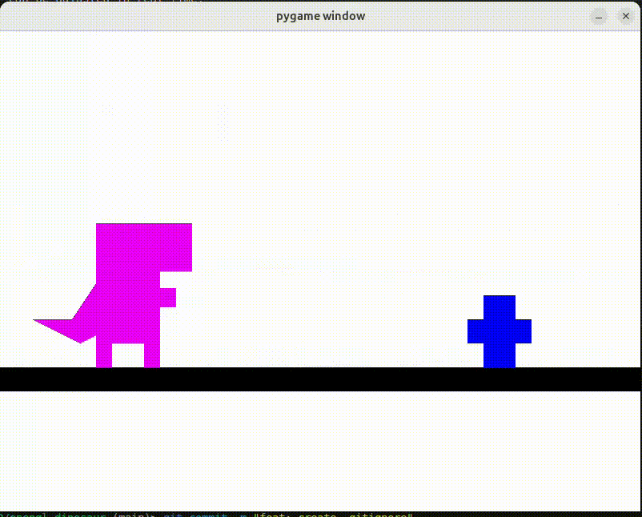

# Dinosaur Game with OpenGL Shaders

This project is a reimagined version of the classic Chrome Dinosaur game, developed using Python and OpenGL. The game leverages shader matrices and algebraic operations to perform movements like scaling, translation, and rotation, optimizing graphic performance.

## Technologies Used

- **Python 3.x**
- **OpenGL (PyOpenGL)**
- **Pygame** (for window management and input handling)
- **NumPy** (for matrix operations)
- **GLSL Shaders** (for rendering)

## Setup and Installation

### Prerequisites

Ensure you have the following installed:

- **Python 3.x**
- **pip** (Python package installer)

### Installation Steps

1. **Clone the Repository**

   ```bash
   git clone https://github.com/yourusername/dinosaur-opengl-game.git
   cd dinosaur-opengl-game
   ```

2. **Create a Virtual Environment (Optional but Recommended)**

   ```bash
   python -m venv venv
   # Activate the virtual environment:
   # On Windows:
   venv\Scripts\activate
   # On macOS/Linux:
   source venv/bin/activate
   ```

3. **Install Dependencies**

   ```bash
   pip install -r requirements.txt
   ```

   *If `requirements.txt` is not provided, install dependencies manually:*

   ```bash
   pip install pygame PyOpenGL numpy
   ```

## Running the Game

Execute the `main.py` script:

```bash
python main.py
```

## Controls

- **Jump:** `Space`
- **Double Jump & Flip:** Press `Space` again while in the air.
- **Grow Dinosaur:** `O`
- **Shrink Dinosaur:** `P`
- **Throw Fireball:** `F`

## Game Mechanics

- **Dinosaur Movements:**
  - The dinosaur can perform a double jump, with the second jump initiating a flip.
  - The size of the dinosaur can be adjusted in real-time.
- **Obstacles:**
  - Cacti appear on the ground.
  - Birds fly at a higher altitude and can be destroyed with fireballs.
- **Fireballs:**
  - Grow in size over time.
  - Eliminate birds upon collision.
- **Objective:**
  - Avoid obstacles and survive as long as possible.

## Code Overview

### Transformations and Shaders

- **Matrix Operations:**
  - Used for all graphical transformations to optimize performance.
  - Includes scaling, translation, and rotation matrices.
- **Shaders:**
  - **Vertex Shader:** Handles vertex transformations.
  - **Fragment Shader:** Manages pixel coloring.

### Game Loop Structure

1. **Event Handling:**
   - Captures keyboard inputs for controlling the dinosaur.
2. **Updating Game State:**
   - Updates positions and states of all game objects.
3. **Rendering:**
   - Draws all game objects using OpenGL calls.

## License

This project is licensed under the GPL License. See the [LICENSE](LICENSE) file for details.

## Acknowledgments

- Inspired by the classic Chrome Dinosaur game.
- Utilized resources from the OpenGL and Pygame communities.

# Thank You for Playing!

Feel free to reach out if you have any questions or suggestions.

## Gameplay Showcase

